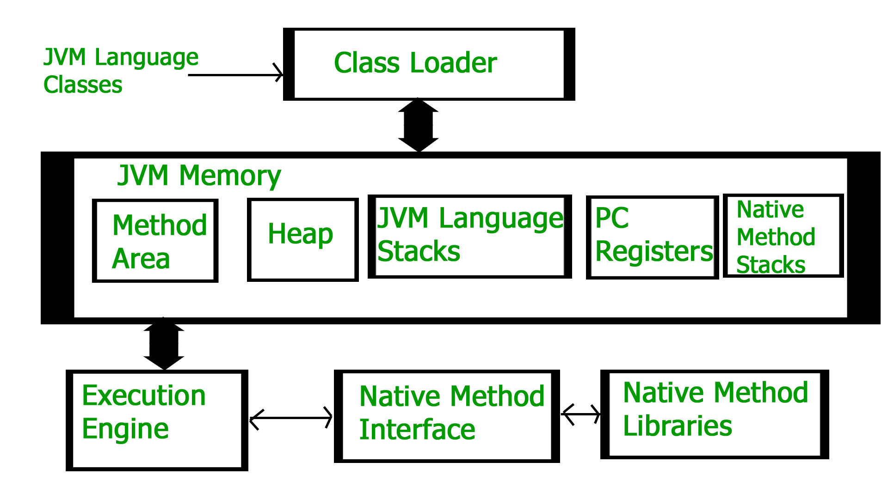

# `JVM`

`아래 내용은 제가 공부하며 배운 점을 정리한 내용이며, 틀린 부분이 존재할 수 있습니다`

 

JVM은 간단히 설명하면 .class 파일을 실행 시킬 수 있는 프로그램입니다. 

JVM에선 이 클래스 파일들을 Execution 엔진을 통해 기계어로 번역해 실행합니다.
어떻게 보면 인터프리터 언어의 특징도 가지고 있는 것 같습니다.

즉 JVM만 OS위에 실행되고 있다면, 클래스 파일을 실행시킬 수 있습니다.

 

## Class Loader

클래스 파일, JAR 파일이 실행되는 시점에서 가장 먼저 class loader가 동작합니다.

이러한 클래스들은 JVM이 이해할 수 있는 형태로 메모리 위에 올라가며 각 클래스들의 정보를 보관합니다

클래스 로더는 가장 기본적으로 제공되는 Java 클래스들부터, 제가 작성한 클래스까지 Method Area에 클래스 정보와 함께 올립니다.

이 과정에서 링킹도 함께 해주면서 정적 변수의 초기화, 필드나 참조의 실 메모리 위치도 클래스 정보에 담습니다.

기본적으로 클래스 로더는 Lazy Loading 이지만 스프링이 초기화되는 것을 생각하면, 실행 시점에서 모두 메소드 영역으로 로딩 된다고 봐도 무방할 것 같습니다.

## Heap

힙은 new를 통한 객체와 List 객체 등이 생성되는 공간이며, GC의 정리 대상입니다.

일정 주기로 더 이상 참조되지 않는 모든 객체를 제거하며, 이 과정은 모든 쓰레드가 블락당한다고 합니다. 

따라서 Tunning의 대상이 바로 GC라고 합니다.

## Stack, PC Register
