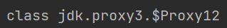
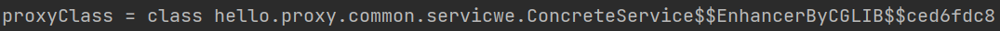

# Proxy

프록시(Proxy)는 영어로 '대리', '대리인'을 뜻하는 단어입니다. 

스프링에서는 이런 프록시 객체를 실제로 구현하지 않고 크게 **CGLIB, JDK**를 통해 런타임 환경에서 구현할 수 있습니다.

CGLIB의 경우 **인터페이스가 없는** 클래스를, JDK는 **인터페이스의 구현체**를 상대로 프록시 객체를 만드는 데 사용합니다.

<br>
이렇게 만든 프록시 객체는 빈으로 등록해 디자인 패턴들 중 프록시 패턴과 데코레이터 패턴을 구현하는 데 사용됩니다. 프록시 패턴은 기존 구현체에 접근 제한을, 데코레이터 패턴은 새로운 기능을 추가하는 데 사용합니다.
<br>

## JDK 동적 프록시 

```
package java.lang.reflect;

public interface InvocationHandler 
```

reflect 패키지의 InvocationHandler 인터페이스를 구현하는 것으로 JDK 동적 프록시를 구현할 수 있습니다.

여기서 reflect의 경우, 클래스를 분석해 런타임 시점에서 객체를 생성하거나 필드를 주입하는 역할을 할 수 있는 자바 기본 라이브러리입니다.

<br>

```
    public TimeInvocationHandler(Object target) {
        this.target = target;
    }

    @Override
    public Object invoke(Object proxy, Method method, Object[] args) throws Throwable {
        log.info("TIME PROXY 실행");
        long startTime = System.currentTimeMillis();
        Object result = method.invoke(target, args);
        long resultTime = System.currentTimeMillis()-startTime;
        log.info("TIME PROXY 종료, 걸린 시간 = {}", resultTime);
        return result;
    }
```

이렇게 invoke 메소드를 오버라이딩하고, 생성과정에서 target 인터페이스를 주입해주는 것으로 간단한 실행 로그 JDK 프록시를 구현할 수 있습니다.

모든 프록시 객체는 이런 식으로 구현됩니다. 
실질적인 기능을 담당하는 Advice와 제한을 맡는 PointCut이 조합된 Advisor를 프록시 객체가 여럿 갖고 있는 형식이라고 합니다.


```
        AInterface target = new AImpl();
        TimeInvocationHandler timeInvocationHandler = new TimeInvocationHandler(target);

        AInterface proxy = (AInterface) Proxy.newProxyInstance(AInterface.class.getClassLoader(), new Class[]{AInterface.class}, timeInvocationHandler);
```

JDK 동적 프록시이므로, 프록시의 타겟이 될 객체는 인터페이스 구현 객체이며
Proxy 생성 메소드를 통해서 가져온 Object를 다운 캐스팅하여, 인터페이스로 변환한 모습입니다.



실제로 proxy의 class는 AImpl이 아닌 Proxy라는 객체입니다. 이 프록시는 AInterface의 구현체이며 메소드를 실행할 시, 앞서 작성한 invoke를 구현하게 됩니다.

<br>

## CGLIB

cglib의 경우, 구현 인터페이스가 없는 객체에 프록시 객체를 생성해주는 스프링 라이브러리입니다.

구현은 다음과 같습니다.

```
public interface MethodInterceptor extends Callback {
    Object intercept(Object var1, Method var2, Object[] var3, MethodProxy var4) throws Throwable;
}
```
```
    public TimeMethodInterceptor(Object target) {
        this.target = target;
    }

    @Override
    public Object intercept(Object obj, Method method, Object[] args, MethodProxy methodProxy) throws Throwable {
        log.info("TIME PROXY 실행");
        long startTime = System.currentTimeMillis();
        Object result = methodProxy.invoke(target, args);
        long resultTime = System.currentTimeMillis()-startTime;
        log.info("TIME PROXY 종료, 걸린 시간 = {}", resultTime);
        return result;
    }
```
```
        ConcreteService target = new ConcreteService();
        Enhancer enhancer = new Enhancer();
        enhancer.setSuperclass(ConcreteService.class);
        enhancer.setCallback(new TimeMethodInterceptor(target));

        ConcreteService proxy = (ConcreteService) enhancer.create();
```

타겟 객체를 주입하거나, 메소드를 Override하는 것이 매우 유사한 것을 볼 수 있습니다.
다만 다른 점은 프록시 객체가 타겟 클래스의 자식 클래스라는 점입니다.



<br>
아직 갈길이 멉니다. 이 과정을 통해서 원하는 객체에 기능이나 제한을 추가한 프록시 객체를 생성할 수 있습니다.
하지만 다음과 같은 한계가 존재합니다.

- 인터페이스와 객체 간의 프록시를 만드는 방법이 다르다
- 스프링 빈으로 일일이 주입하기 번거롭다.
- 컴포넌트 스캔(Controller, Service ..)의 대상은 주입하기 어렵다.
- 일부 메소드에만 적용하기 어렵다.


당연하게도 스프링은 모든 대안이 존재합니다. 

대안은 다음과 같습니다. **프록시 팩토리, 빈 후처리기, AOP**